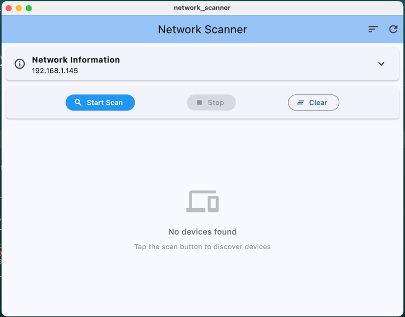
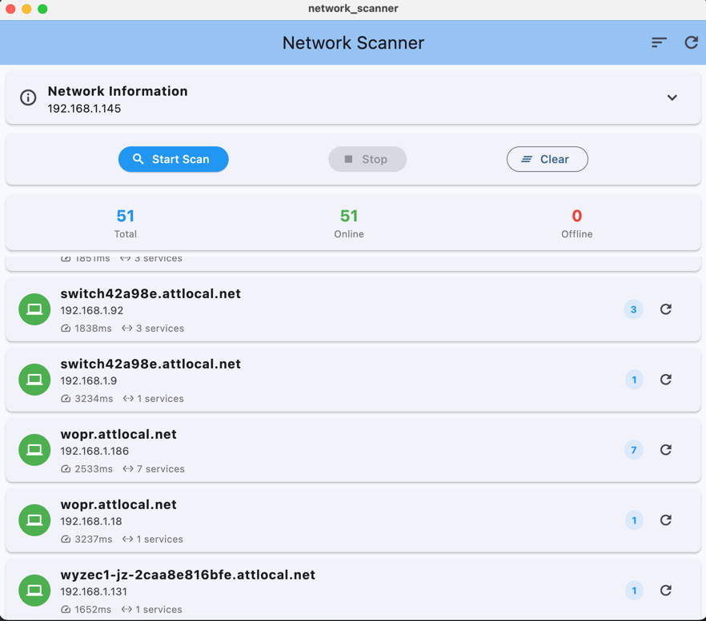
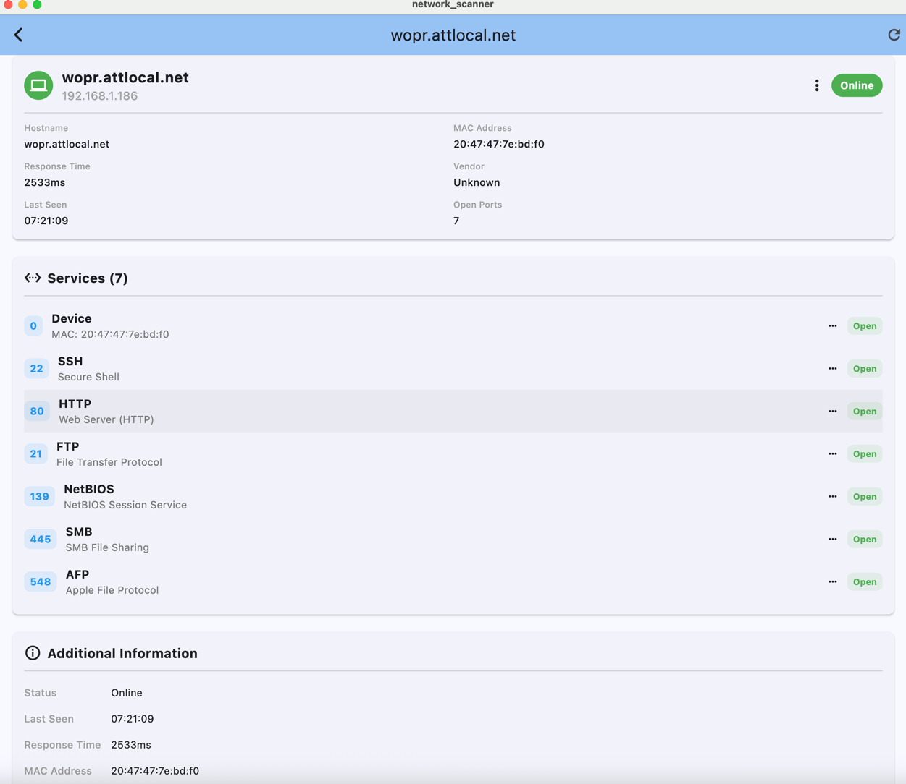

# Network Scanner

A powerful, cross-platform network discovery and port scanning application built with Flutter. This app provides comprehensive network analysis capabilities with an intuitive user interface, supporting macOS, Linux, and Windows desktop platforms.

## 🚀 Purpose

Network Scanner is designed to help network administrators, security professionals, and IT enthusiasts discover and analyze devices on their local network. The app provides:

- **Network Device Discovery**: Automatically detects active hosts on your local network
- **Port Scanning**: Identifies open ports and running services on discovered devices
- **Service Detection**: Recognizes common services and provides detailed descriptions
- **Multi-Method Discovery**: Uses ARP table lookup, TCP connections, and ICMP ping for comprehensive host detection
- **Copy-to-Clipboard**: Easy data export with one-click copying of host information and service details
- **Real-time Updates**: Live scanning with progress indicators and real-time results


The basic user experience once started.



A scan of the local network sorted by host.  Shows host name, ip and how many services are exposed.



A more detailed breakdown of the host including exposed ports.


## 🏗️ Architecture & Design

### Core Components

#### 1. **Network Discovery Engine**
- **Primary Scanner**: Fast network discovery using platform-specific methods
- **Fallback TCP Scanner**: Socket-based scanning for comprehensive coverage
- **ARP Table Integration**: Leverages system ARP tables for MAC address and hostname resolution
- **Multi-phase Scanning**: Two-phase approach for optimal speed and accuracy

#### 2. **Service Detection**
The app scans a comprehensive list of common ports including:
- Web services (HTTP/HTTPS: 80, 443, 8080, 8443)
- Remote access (SSH: 22, RDP: 3389, VNC: 5900)
- File sharing (SMB: 445, FTP: 21, AFP: 548)
- Databases (MySQL: 3306, PostgreSQL: 5432)
- IoT and smart home protocols (MQTT: 1883)
- And many more...

#### 3. **User Interface**
- **Material Design 3**: Modern, responsive UI following Flutter's latest design guidelines
- **Responsive Layout**: Adapts to different screen sizes and orientations
- **Real-time Progress**: Live scan progress with percentage completion
- **Detailed Host Views**: Comprehensive host information with service breakdowns
- **Copy Functionality**: Multiple copy options for easy data export

#### 4. **Data Management**
- **State Management**: Uses Provider pattern for efficient state management
- **Host Models**: Structured data models for hosts, services, and network information
- **Real-time Updates**: Live updates during scanning process

### Security Considerations

- **Network Permissions**: Requires appropriate network permissions for socket operations
- **Sandbox Compatibility**: Designed to work within platform security sandboxes
- **Local Network Only**: Focuses on local network discovery for security and performance
- **No Data Collection**: All scanning is performed locally with no external data transmission

## 🛠️ Prerequisites

Before building the app, ensure you have:

1. **Flutter SDK** (3.0.0 or later)
   ```bash
   flutter --version
   ```

2. **Platform-specific requirements**:
   - **macOS**: Xcode 14.0+ with command line tools
   - **Linux**: Build essentials, GTK development libraries
   - **Windows**: Visual Studio 2019+ with C++ desktop development tools

3. **Git** for version control

## 📦 Installation & Setup

### 1. Clone the Repository
```bash
git clone <repository-url>
cd network_scanner
```

### 2. Install Dependencies
```bash
flutter pub get
```

### 3. Verify Setup
```bash
flutter doctor
```
Ensure all platforms you want to target show no issues.

## 🔧 Build Instructions

### Debug Builds

Debug builds include debugging symbols and hot reload capability:

#### macOS Debug
```bash
# Desktop app
flutter run -d macos

# Or build without running
flutter build macos --debug
```

#### Linux Debug
```bash
# Desktop app
flutter run -d linux

# Or build without running
flutter build linux --debug
```

#### Windows Debug
```bash
# Desktop app
flutter run -d windows

# Or build without running
flutter build windows --debug
```

### Release Builds

Release builds are optimized for distribution:

#### macOS Release
```bash
# Build release version
flutter build macos --release

# The app will be located at:
# build/macos/Build/Products/Release/network_scanner.app
```

To create a distributable DMG:
```bash
# Install create-dmg (if not already installed)
brew install create-dmg

# Create DMG
create-dmg \
  --volname "Network Scanner" \
  --window-pos 200 120 \
  --window-size 600 300 \
  --icon-size 100 \
  --app-drop-link 450 120 \
  "Network Scanner.dmg" \
  "build/macos/Build/Products/Release/network_scanner.app"
```

#### Linux Release
```bash
# Build release version
flutter build linux --release

# The executable will be located at:
# build/linux/x64/release/bundle/network_scanner
```

To create a distributable package:
```bash
# For AppImage (requires appimagetool)
# Create AppDir structure and use appimagetool

# For Snap package
snapcraft

# For Flatpak
flatpak-builder build-dir com.example.network_scanner.yml
```

#### Windows Release
```bash
# Build release version
flutter build windows --release

# The executable will be located at:
# build/windows/x64/runner/Release/network_scanner.exe
```

To create an installer:
```bash
# Using Inno Setup (install Inno Setup first)
# Create an .iss script file and compile with:
iscc installer_script.iss

# Or use NSIS
makensis installer_script.nsi
```

## 🔍 Platform-Specific Features

### macOS
- **Entitlements**: Configured with network client/server entitlements for socket operations
- **Sandbox**: Compatible with App Store sandboxing requirements
- **Code Signing**: Ready for code signing and notarization

### Linux
- **GTK Integration**: Native Linux desktop integration
- **System Permissions**: Requires network access permissions
- **Package Management**: Compatible with major Linux package managers

### Windows
- **Windows API**: Utilizes Windows networking APIs
- **UAC Compatibility**: Designed to work without elevated privileges where possible
- **Windows Defender**: Optimized to avoid false positives from security software

## 🏃‍♂️ Running the App

### Development Mode
```bash
# Hot reload enabled
flutter run -d <platform>

# With specific target
flutter run -d macos    # macOS
flutter run -d linux    # Linux
flutter run -d windows  # Windows
```

### Profile Mode
```bash
# Performance profiling
flutter run --profile -d <platform>
```

## 🧪 Testing

### Unit Tests
```bash
flutter test
```

### Integration Tests
```bash
flutter test integration_test/
```

### Platform Testing
```bash
# Test on specific platform
flutter test --platform <platform>
```

## 📁 Project Structure

```
network_scanner/
├── lib/
│   ├── main.dart                 # App entry point
│   ├── models/                   # Data models
│   │   ├── host.dart            # Host model
│   │   ├── service.dart         # Service model
│   │   └── network_info.dart    # Network information model
│   ├── providers/                # State management
│   │   └── network_scan_provider.dart
│   ├── screens/                  # UI screens
│   │   ├── home_screen.dart     # Main scanner interface
│   │   └── host_details_screen.dart # Host details view
│   ├── services/                 # Core services
│   │   ├── network_scanner.dart # Main scanner interface
│   │   ├── primary_scanner.dart # Primary discovery methods
│   │   ├── fallback_scanner.dart # Socket-based fallback
│   │   └── port_definitions.dart # Service definitions
│   └── utils/                    # Utilities
│       └── network_utils.dart   # Network helper functions
├── macos/                        # macOS specific files
├── linux/                       # Linux specific files
├── windows/                      # Windows specific files
├── test/                        # Unit tests
├── integration_test/            # Integration tests
└── pubspec.yaml                 # Dependencies and metadata
```

## 🔧 Configuration

### Network Permissions

#### macOS (macos/Runner/DebugProfile.entitlements & Release.entitlements)
```xml
<key>com.apple.security.network.client</key>
<true/>
<key>com.apple.security.network.server</key>
<true/>
```

#### Linux
No special configuration required for basic networking.

#### Windows
Ensure Windows Firewall allows the application if needed.

### Customization

#### Port Scanning Configuration
Edit `lib/services/port_definitions.dart` to modify:
- Scanned port ranges
- Service definitions
- Scanning timeouts
- Batch sizes

#### UI Customization
Modify theme and styling in:
- `lib/main.dart` - App theme configuration
- Individual screen files for layout adjustments

## 🎯 Key Features

### Copy-to-Clipboard Functionality
The app includes comprehensive copy functionality:
- **Host Information**: Copy IP addresses, hostnames, and MAC addresses
- **Service Details**: Copy individual port numbers, service names, and descriptions
- **Complete Summaries**: Copy comprehensive host and service information
- **Visual Feedback**: Floating snackbars confirm successful copy operations

### Multi-Method Host Discovery
- **ARP Table Scanning**: Fast discovery of hosts with MAC address resolution
- **TCP Socket Scanning**: Comprehensive port scanning with service detection
- **ICMP Ping**: Alternative connectivity verification
- **Hostname Resolution**: Automatic DNS and mDNS hostname lookup

### Advanced Service Detection
Scans 50+ common ports including:
- **Web Services**: HTTP (80), HTTPS (443), Alternative HTTP (8080, 8443)
- **Remote Access**: SSH (22), RDP (3389), VNC (5900), TeamViewer (5938)
- **File Sharing**: FTP (21), SFTP (22), SMB (445), AFP (548)
- **Databases**: MySQL (3306), PostgreSQL (5432), MongoDB (27017)
- **IoT/Smart Home**: MQTT (1883), Home Assistant (8123)
- **Network Services**: DNS (53), DHCP (67), SNMP (161)
- **Media**: Plex (32400), Kodi (8080), AirPlay (5000)

## 🐛 Troubleshooting

### Common Issues

#### Build Errors
- **"Operation not permitted"**: Ensure network entitlements are properly configured (macOS)
- **GTK errors**: Install GTK development libraries (Linux)
  ```bash
  # Ubuntu/Debian
  sudo apt-get install libgtk-3-dev
  
  # Fedora
  sudo dnf install gtk3-devel
  ```
- **Visual Studio errors**: Ensure C++ desktop development tools are installed (Windows)

#### Runtime Issues
- **No hosts found**: Check network connectivity and permissions
- **Slow scanning**: Adjust timeout values in scanner configuration
- **Permission denied**: Run with appropriate network permissions

#### Performance Issues
- **High CPU usage**: Reduce concurrent scanning batch sizes
- **Memory leaks**: Ensure proper disposal of network connections
- **UI freezing**: Verify async/await usage in scanning operations

### Debug Commands

```bash
# Verbose output
flutter run -v -d <platform>

# Debug with inspector
flutter run --debug -d <platform>

# Performance analysis
flutter run --profile -d <platform>

# Build analysis
flutter analyze
```

## 🤝 Contributing

1. Fork the repository
2. Create a feature branch: `git checkout -b feature-name`
3. Commit changes: `git commit -am 'Add new feature'`
4. Push to branch: `git push origin feature-name`
5. Submit a pull request

### Development Guidelines

- Follow Flutter/Dart style guidelines
- Add tests for new functionality
- Update documentation for API changes
- Ensure cross-platform compatibility
- Test on all target platforms before submitting

## 📄 License

This project is licensed under the MIT License - see the LICENSE file for details.

## 🙏 Acknowledgments

- Flutter team for the excellent cross-platform framework
- Network security community for port scanning best practices
- Contributors and testers who helped improve the application

## 📞 Support

For issues, feature requests, or questions:
- Create an issue on the repository
- Check existing documentation and troubleshooting guide
- Review Flutter documentation for platform-specific issues

---

**Note**: This application is intended for legitimate network administration and security analysis purposes. Users are responsible for ensuring compliance with applicable laws and network policies when using this software.
